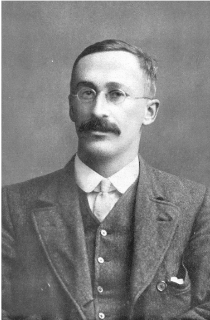
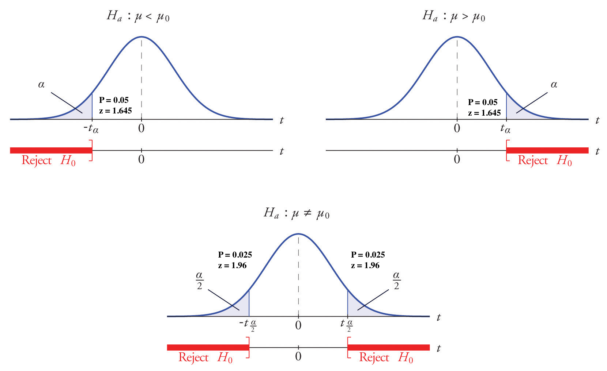
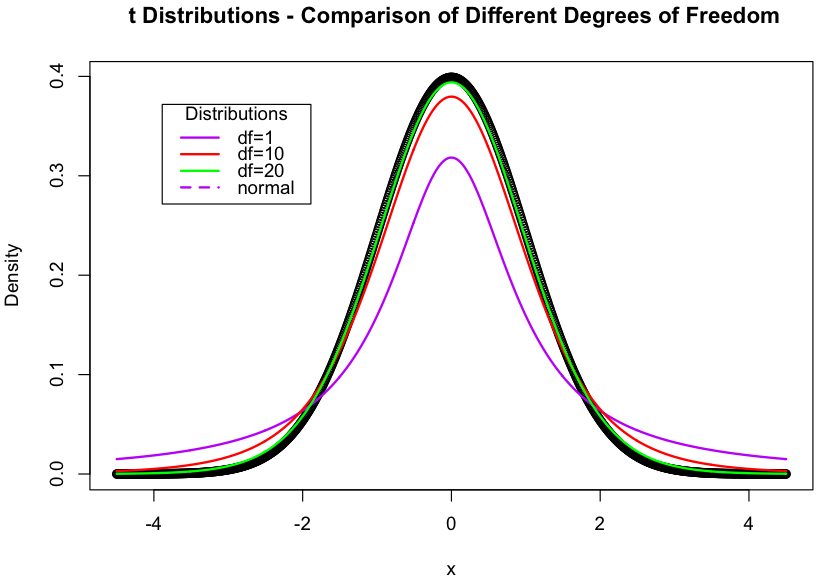
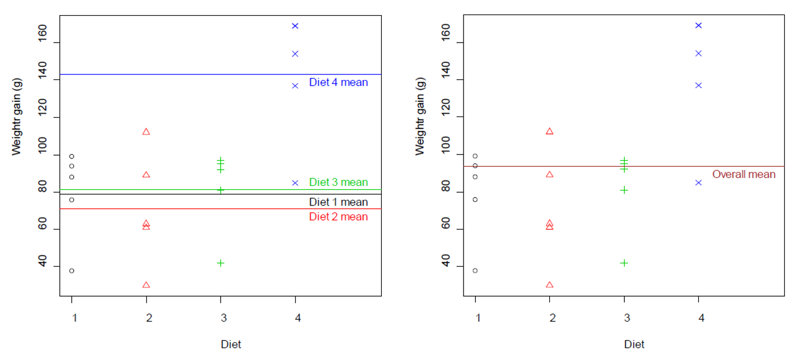

```{r, load_refs, echo=FALSE, cache=FALSE, message=FALSE}
library(RefManageR)
library(readr)
library(kableExtra)
library(ggplot2)
library(tidyr)
library(dplyr)

options(knitr.kable.NA = '')

BibOptions(check.entries = FALSE, 
           bib.style = "authoryear", 
           cite.style = 'authoryear', 
           style = "markdown",
           hyperlink = FALSE, 
           dashed = FALSE)
myBib <- ReadBib("assets/example.bib", check = FALSE)
```


## Outline

.pull-left[

### Two-sample t-test


[William Gosset (1908)](https://medium.com/value-stream-design/the-curious-tale-of-william-sealy-gosset-b3178a9f6ac8)
]


.pull-right[
### Analysis of Variance (ANOVA)


[Ronald Fisher (1925)](https://link.springer.com/chapter/10.1007/978-1-4612-4380-9_7)
]


---
## Learning outcomes


At the end of this topic students should be able to:
- Describe the concept of how the ANOVA is used to determine whether there is a statistically significant difference in the means of treatments;
- Demonstrate proficiency in the use of R (and interpretation of the output) for performing an analysis of variance (ANOVA) on experimental data with 1 treatment factor.


---
## Revisiting the t-test

### Example

.pull-left[
- Weights of two breeds of cattle are to be compared
- Twelve cattle from Breed 1 were randomly sampled, and another 15 weights from Breed 2 were also recorded
]

.pull-right[
```{r, echo=F, message=F}
cattle <- read_csv("assets/tables/cattle.csv")
kable(cattle) %>%
  kable_styling(font_size = 16)
  
```
]


---
## Two-sample t-test


### Import data

```{r, message=F}
cattle <- read_csv("assets/tables/cattle.csv") %>%
  pivot_longer(cols = starts_with("Breed"), names_to = "breed", values_to = "weight") %>%
  mutate(breed = as.factor(breed))
  
```
[Tidying the data](https://r4ds.had.co.nz/tidy-data.html)  (FYI). 

.pull-left[
**Before**
.scroll-box-10[
```{r, echo=F, message=F}
read_csv("assets/tables/cattle.csv")
```
]
]

.pull-right[
**After**
.scroll-box-10[
```{r, echo=F}
cattle
```
]
]


---
## Two-sample t-test
.pull-left[
### Descriptive statistics (mean)

```{r}
with(cattle, mean(weight[breed == "Breed1"], 
  na.rm = TRUE))

with(cattle, mean(weight[breed == "Breed2"], 
  na.rm = TRUE))
```
]

.pull-right[
### Descriptive statistics (sd)

```{r}
with(cattle, sd(weight[breed == "Breed1"], 
  na.rm = TRUE))
with(cattle, sd(weight[breed == "Breed2"], 
  na.rm = TRUE))
```
]


---
## Two-sample t-test

### Model assumptions: Equal variances
- $\sigma^2_1 \approx \sigma^2_2$
- General guide: $\frac{larger\ standard\ deviation}{smaller\ standard\ deviation} < 2.0$

```{r}
12.30139/10.61604
```

- Only difference between the two distributions is where the distribution located, otherwise the same


---
## Two-sample t-test

### Model assumptions: Normality
.pull-left[

```{r, echo=FALSE}
cattle <- na.omit(cattle)
```

```{r, warning=F, out.width=400}
ggplot(cattle, aes(breed, weight)) +
  geom_boxplot() + cowplot::theme_cowplot()
```
]

.pull-right[
```{r, out.width=400}
hist(cattle$weight)
```
]


---
## Two-sample t-test
### Model assumptions: Normality

- $y_{i,j} \sim N(\mu_i, \sigma^2)$ or $\varepsilon_{i,j} \sim N(\mu_i, \sigma^2)$

```{r}
shapiro.test(cattle$weight)
```

- If p > 0.05, the distribution of the `cattle` data is not significantly different from a normal distribution, *i.e.* we can assume normality.


---
## Two-sample t-test
### Model equation

- Observed data = Group Mean + Random Error (residuals)
$$y_{i,j} = \mu_i + \varepsilon_{i,j}$$
- $i = 1, 2\ (group)$; $j = 1, 2, ..., n_i\ (replicate)$

In cattle example:
- $\mu_1$ = mean body weight (kg) for cattle in Breed 1
- $\mu_2$ = mean body weight (kg) for cattle in Breed 2


---
## Two-sample t-test
### T-test

```{r}
with(cattle, t.test(weight[breed == "Breed1"], weight[breed == "Breed2"],
  var.equal = TRUE))
```


---
## Two-sample t-test
### Interpretation

.center[

]


---
## Two-sample t-test
### Hypothesis testing

- Null hypothesis: $$H_0:\mu_1 = \mu_2$$
- Alternate hypothesis: $$H_1:\mu_1 \neq \mu_2$$
- Test statistic: $$t= \frac{\bar y_2 - \bar y_1}{\sqrt{s^2(\frac{1}{n_2} + \frac{1}{n_1})}} = \frac{\bar y_2 - \bar y_1}{se(\bar y_2 - \bar y_1)} = \frac{\Delta\ in\ mean}{standard\ error\ of\ the\ \Delta \ in\ mean}$$
- Degrees of freedom: $$n_1 + n_2 - 2$$


---
## T-distribution

.pull-left[
- changes shape with datasets size – degrees of freedom (df)
- as n increases >> closer to normal distribution
- for standard normal distribution, 95% observations found in interval [-1.96,1.96]
]

.pull-right[

]


---
## Analysis of Variance (ANOVA)
### Example

.pull-left[
- A study was undertaken to compare the weight gains (g) of chicks on four different diets
- Twenty similar chicks were used in the study and were randomly allocated to one of the four groups
- The allocation was done in such a way as to have equal replication (five chicks) in each treatment group
]

.pull-right[
```{r, message=F, echo=F}
read_csv("assets/tables/chicks.csv") %>%
  kable() %>%
  kable_styling()
```
]


---
## Should we use a t-test?

- We have 4 treatments
- We could do a series of t-tests for the 6 possible pairwise comparisons
  - 1 vs 2; 1 vs 3; 1 vs 4; 2 vs 3; 2 vs 4; 3 vs 4
- **Problem:**  even if the true differences between treatment (population) means differ, each test has a 5% probability of incorrectly finding significant results
  - 6 tests, we have 0.95<sup>6</sup> = 0.735 = 73.5% of getting all correct
  - 26.5% chance of getting at least 1 incorrect
- We need a method to test for the equality of treatments simultaneously
  - This avoids the problem of multiple comparisons


---
## ANOVA


- Differences between the 4 diets
  - treatment effect
- Differences within diets
  - due to background random environmental fluctuations, genetics, experimental error


---
## ANOVA

Which model best describes data?

.center[
.pull-left[
.center[Group means shown separately]
]
.pull-right[
.center[Overall mean]
]

]


---
## ANOVA: Terminology

- Suppose in general that we have $t$ different treatments, and have drawn samples of size $n_1, n_2, ..., n_t$ from the 1<sup>st</sup>, 2<sup>nd</sup>, …, $t$<sup>th</sup> population
- The total number of observations is $n_1, n_2, ..., n_t = N$. In the diets example, there are $t = 4$ treatments, with equal replication $(n_1 = n_2 = n_3 = n_4 = 5)$ with $N = 20$
- For equally replicated designs, we will use $r$ as the number of replicates per group (with $N = rt$)
- In the chick example, there is only **one factor** or treatment factor (diet)
- That factor has 4 levels (the 4 diet options).
- Hence the ANOVA conducted on these data is a **1-way (or 1-factor)** ANOVA 


---
## ANOVA
### Model equation

- Observed data = Group Mean + Random Error (residuals)
$$y_{i,j} = \mu_i + \varepsilon_{i,j}$$
- $i = 1, 2\ (group)$; $j = 1, 2, ..., n_i\ (replicate)$

In cattle example:
- $y_{i,j}$ = observed weight gain for $j$<sup>th</sup> chicken on Diet $i$;

- $\mu_i$ = mean weight gain for chicks on Diet, $i$.


---
## ANOVA
### Model assumptions: Normality


.pull-left[
- $y_{i,j} \sim N(\mu_i, \sigma^2)$ or $\varepsilon_{i,j} \sim N(\mu_i, \sigma^2)$
- Check this assumptions using a histogram, boxplot for each group
- Or examine residuals (Topic 4)

.small[
```{r, message=F}
chicks <- read_csv("assets/tables/chicks.csv") %>%
  pivot_longer(cols = starts_with("Diet"), 
    names_to = "diet", 
    values_to = "weight") %>%
  mutate(diet = as.factor(diet)) 
```
]
]

.pull-right[

```{r, out.width=400}
ggplot(chicks, aes(diet, weight)) +
  geom_boxplot() 
```
]


---
## ANOVA
### Model assumptions: Normality

.pull-left[
```{r, out.width=450}
hist(chicks$weight)
```
]


.pull-right[
```{r}
shapiro.test(chicks$weight)
```

- If p > 0.05, the distribution of the `cattle` data is not significantly different from a normal distribution, *i.e.* we can assume normality.
]


---
## ANOVA
### Model assumptions: Equal variances
- $\sigma^2_1 = \sigma^2_2 =  ... = \sigma^2_t$
- General guide: $\frac{largest\ standard\ deviation}{smallest\ standard\ deviation} < 2.0$
- Alternatively: perform a formal hypothesis test, e.g. Bartlett’s test of homogeneity of variance. 

```{r}
bartlett.test(weight ~ diet, data = chicks)
```

- **Bartlett's test is not reliable if data is not normal**


---
## ANOVA
### Hypothesis testing

- Null hypothesis: $$H_0:\mu_1 = \mu_2 = ... = \mu_t$$
- Alternate hypothesis: $$H_1:not\ all\ \mu_i\ are\ equal$$

- **Important:** only tells us that at least 2 treatment (group) means are different


---
## ANOVA
### Concept

- Partition the variability of the data into components:
  - Differences due to treatments
  - Residual variation

.center[
> Total Sums-of-Square (SS) = Treatment SS + Residual SS
]


---
## ANOVA 
### Table

- Partition the variability of the data into components:
  - Differences due to treatments
  - Residual variation


```{r, echo=F, message=F}
read_csv("assets/tables/anovat1.csv") %>% 
  kable()
```

.small[
.center[
$N$ = number of observations, $t$ = treatment levels
]
]


---
## ANOVA
### Calculations


Total sum-of-squares, $SS_{tot}$


$$SS_{tot} = \sum(data - overall\ mean)^2$$

```{r, message=F}
library(dplyr) # load package
overall_mean <- mean(chicks$weight) # calculate overall mean
tot_ss <- mutate(chicks, sst = (weight - overall_mean)^2) # calculate (data - overall mean)^2
sum(tot_ss$sst) # sum for total ss
```


---
## ANOVA
### Calculations
Treatment sum-of-squares, $SS_{trt}$

$$SS_{trt} = \sum n_i \times (group\ mean - overall\ mean)^2$$

```{r}
# using dplyr again
chicks <- group_by(chicks, diet) # group by diet, so that we can summarise by group
grp <- summarise(chicks, grp_mean = mean(weight)) # summarise by group
trt_ss <- mutate(grp, sstr = (grp_mean - overall_mean)^2) # calculate (grp mean - overall mean)^2 
5* sum(trt_ss$sstr) # sum for treatment ss
```


---
## ANOVA
### Calculations
Residual sum-of-squares, $SS_{res}$

$$SS_{res} = \sum(data - group\ mean)^2$$


```{r}
merged <- merge(chicks, grp)
res_ss <- mutate(merged, ssr = (weight - grp_mean)^2)
sum(res_ss$ssr)
```


---
## ANOVA 
### Table


```{r, echo=F, message=F}
read_csv("assets/tables/anovat1.csv") %>% 
  kable()
```

### Chick weight example

```{r, echo=F, message=F}
read_csv("assets/tables/anovat2.csv") %>% 
  kable()
```


---
## ANOVA


### R 
```{r, message=F}
model <- aov(weight ~ diet, data = chicks)
summary(model)
```


### Table
```{r, echo=F, message=F}
read_csv("assets/tables/anovat2.csv") %>% 
  kable()
```


---
## ANOVA

- Test statistic: $$F = \frac{treatment\ MS}{residual\ MS}; df = t - 1,\ N - 1$$


- the **residual MS** is an estimate of $\sigma^2$, so $s = \sqrt {residual\ MS} = \sqrt{826} = 28.7$
- $s$ is the pooled standard deviation from pooling $t$ = 4 groups
- treatment MS is also an estimate of $\sigma^2$ (if the null hypothesis is true)


---
## ANOVA

- Test statistic: $$F = \frac{treatment\ MS}{residual\ MS}; df = t - 1,\ N - t$$

- If the null hypothesis is true, the observed F statistic (variance ratio) will have a value around 1; large F values indicate the null hypothesis is false

- Hypothesis test: Compare observed F statistic with F distribution with $t-1$ and $N-t$ degrees of freedom (d.f.), e.g. $Ft-1,\ N-t$ or $F_{treat\ d.f., residual\ d.f.}$


---
## ANOVA

- Our example: $F = \frac{5489}{826} = 6.65$ with $d.f. = 3,\ 16$
- Probability of obtaining the observed test statistics or larger, $P = P(F_{3,16} > 6.65 = 0.04)$
- Since p-value is small ($<0.05$) we *reject* the null hypothesis
  - there are *significant differences* in mean weight gain amongst the 4 diets
- Proportion of variability explained by diets: $$\frac{Treatment\ SS}{Total SS} = 16647 \div 29679 = 0.55\ (55\%)$$


---
## ANOVA

Which pairs of groups means are (statistically) different?


.pull-left[
- We could look at the 95% CI for each mean and see which overlap.

$$95\% CI = \bar y \pm t^{0.052}_{residual\ d.f.} \times se(\bar y)$$

.center[where]

$$se(\bar y) = \sqrt{\frac{residual\ MS}{n_i}}$$

and $n_i$ is the number of replicates in treatment, $i$
]


.pull-right[
- e.g. for `Diet 4`:

$$95\% CI = 142.8 \pm 2.12 \times \sqrt{\frac{826}{5}}$$

```{r}
lower <- 142.8 - 2.12 * sqrt(826/5) 
upper <- 142.8 + 2.12 * sqrt(826/5) 
```

$95\% CI$ = [`r round(lower, 1)`, `r round(upper, 1)`]

]


---
## ANOVA

Which pairs of groups means are (statistically) different?

.pull-left[
```{r, message=F}
library(emmeans)
emm <- emmeans(model, "diet")
emm
```
]

.pull-right[
```{r, out.width=420}
plot(emm)
```
]


---
## Summary

- 2-sample t-tests are limited to situation when we have experiments with only 2 levels
- The ANOVA allows us to analyse experiments with 2 or more treatment levels
- It can be generalised to analyse any experiment, e.g. more than 1 treatment factors
- The ANOVA table helps us determine whether there is a significant different between at least one pair of treatment means

### Next week
- How to (better) identify which pair(s) are significant different
- How to test the model assumptions


---
class: center, middle

# Thanks!

Slides created via the R package [**xaringan**](https://github.com/yihui/xaringan).


---
## Readings

- Quinn & Keough (2002)
  - Chapter 7: Section 7.1
- Mead et al. (2002)
  - Chapter 18: Sections 18.1-18.3 (most is for finite populations but useful for conceptual understanding)
